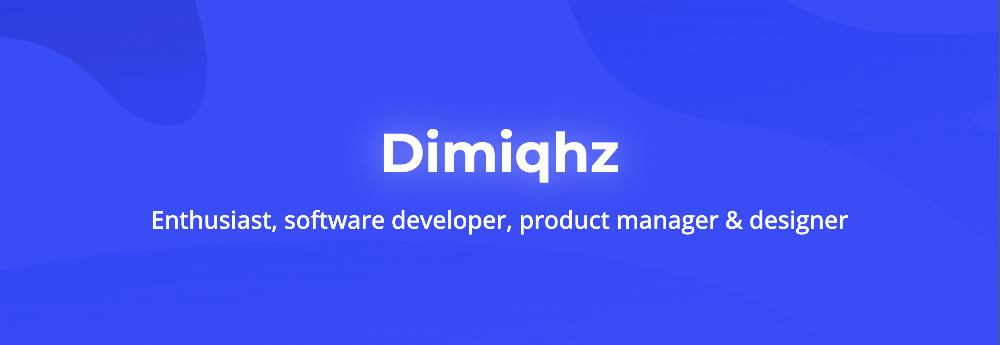

 

<h2 style=" font-size: 24px!important; font-weight: bold!important;">Hello, I'm Dimiqhz! 👋 </h2> 

    <!-- Left Column: Metrics -->
    

        
    

  

        <h3>🌐 Let's Connect and Grow Together!</h3>
        

            
        

        
  <h3>🧑‍💻 About Me</h3>
        

            I am a software developer with more than 10 years of experience under my belt in the areas of Web Development, GameDev and Artificial Intelligence. I love learning new technologies and developing existing ones, as well as creating different interesting things. I also love travelling, physical activity and watching films.
        

  <h3>✨ Fun Facts</h3>
        <ul style="list-style: none;">
            <li> I like to attend events and speak at them whenever possible.</li>
            <li> I started programming at the age of 8, and the first language I started learning was Java.</li>
            <li> I am interested in any field of activity, I like to develop myself and learn new things.</li>
        </ul>
    

<h3>🛠 Languages and tools</h3>

    
Languages

    
Libraries

    
Frameworks

    
Tools and Systems

    
Engines

    
Operating systems

<h3>📊 Stats</h3>

    
Stats

 

    
GitHub Trophies

<h3>🔍 I'm currently learning</h3>

    
Click

 

